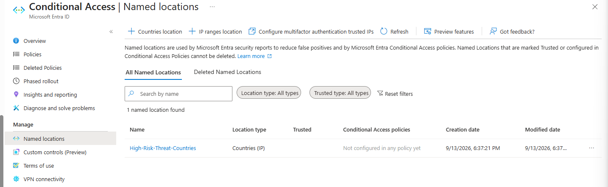
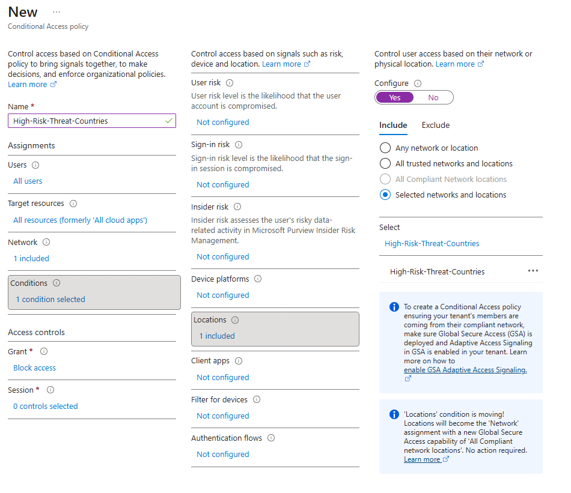
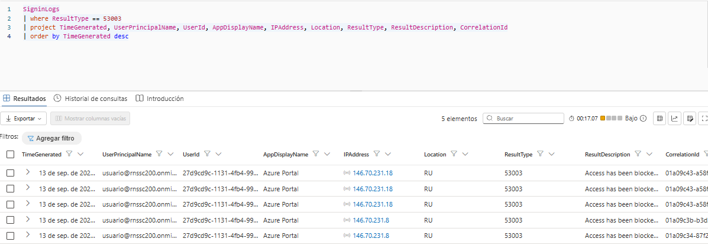
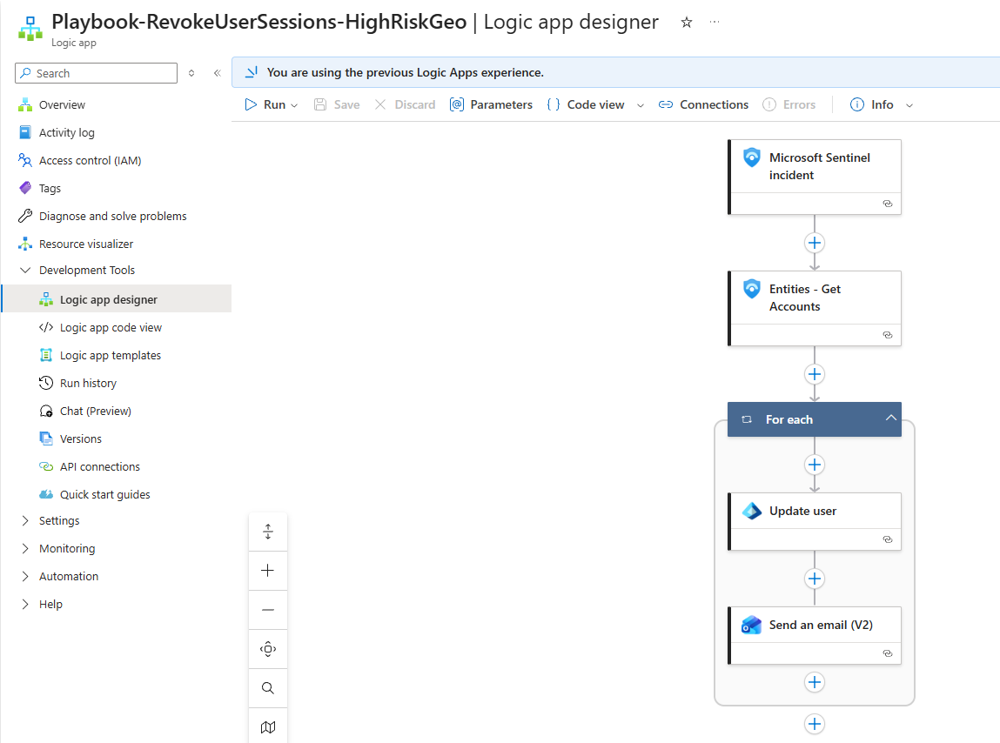
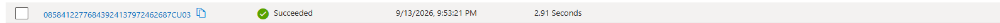
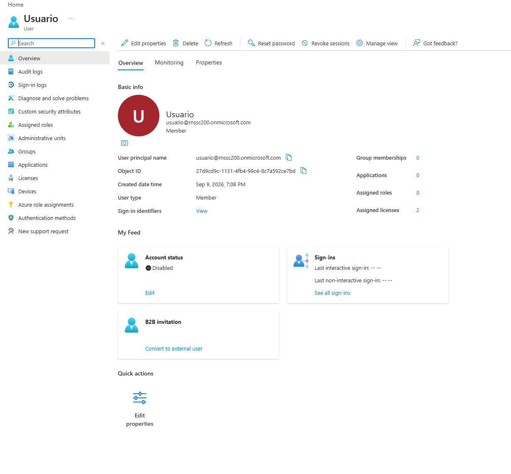
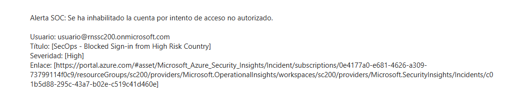

# 🛡️ Detección y Respuesta Automatizada (SOAR) con Microsoft Sentinel y Entra ID

En este proyecto he montado un laboratorio práctico de seguridad defensiva y automatización (SOAR) utilizando las herramientas en la nube de Microsoft: **Microsoft Entra ID**, **Microsoft Sentinel** y **Azure Logic Apps**.

El objetivo de esta práctica es muy claro: si alguien intenta iniciar sesión con una cuenta corporativa desde un país considerado de alto riesgo (como Rusia, China, Irán o Corea del Norte), el sistema no solo debe bloquear la conexión, sino que debe contener la amenaza de forma autónoma. El usuario queda deshabilitado en Entra ID y el equipo de seguridad (SOC) recibe una alerta al instante con todos los detalles del incidente, todo ello sin que ningún analista tenga que intervenir manualmente.

---

## 🧭 ¿Cómo funciona el flujo completo?

El proceso sigue estos pasos:

1. **Intento de conexión hostil:** Alguien intenta entrar a una cuenta desde una IP ubicada en un país vetado.
2. **Bloqueo perimetral:** El Acceso Condicional de Entra ID frena el intento en seco y genera un log con el código de error `53003`.
3. **Detección en el SIEM:** Microsoft Sentinel ingesta la telemetría en la tabla `SigninLogs`. Una regla analítica en KQL detecta el error 53003 y levanta un incidente de seguridad con prioridad Alta.
4. **Respuesta automatizada (SOAR):** En cuanto se crea el incidente, una regla de automatización dispara una Logic App (Playbook).
5. **Contención y aviso:**
   - La Logic App contacta con Entra ID y deshabilita la cuenta de inmediato (en solo **2.25 segundos**).
   - Envía un correo con el formato correcto al buzón del SOC con el nombre del usuario afectado y el enlace directo al incidente en Azure para revisarlo.

---

## 🛠️ Paso a paso: Cómo lo configuré

### 1. Bloqueo geográfico en Microsoft Entra ID

Primero configuré las defensas para impedir que se pueda iniciar sesión desde ubicaciones no permitidas:

* **Creación de la lista de países (Named Locations):**
  Fui a *Entra ID > Conditional Access > Named locations* y creé una lista llamada `High-Risk-Threat-Countries`. Elegí que localizara por dirección IP, incluí países desconocidos y seleccioné países críticos habituales en ciberataques (Rusia, China, Corea del Norte e Irán).



* **Creación de la política de Acceso Condicional:**
  En *Conditional Access > Policies*, creé la política para aplicar el bloqueo:
  * **Usuarios:** Todos los usuarios (*All users*).
  * **Exclusión de seguridad:** Excluí mi cuenta de administrador principal (`rnssc200@rnssc200.onmicrosoft.com`) para evitar quedarme fuera del entorno si algo fallaba.
  * **Condición:** Si la conexión viene de las ubicaciones de la lista `High-Risk-Threat-Countries`.
  * **Acción:** Bloquear el acceso (*Block access*).




---

### 2. Detección y creación del incidente en Microsoft Sentinel

Para que Sentinel se entere del bloqueo y pueda reaccionar:

* **Ingesta de logs:** Conecté Microsoft Entra ID con el área de trabajo de Log Analytics (`sc200`) y me aseguré de que las licencias P2 estuvieran asignadas a los usuarios de prueba para que los inicios de sesión interactivos escribieran en la tabla `SigninLogs`.
* **Regla de detección en KQL:**
  En *Microsoft Sentinel > Analytics*, creé una regla programada con esta consulta:
  ```kql
  SigninLogs
  | where ResultType == 53003
  | project TimeGenerated, UserPrincipalName, IPAddress, Location, AppDisplayName, ResultType



### 3. Automatización de la respuesta con Azure Logic Apps
Aquí es donde entra la parte de SOAR para reaccionar al ataque:

Creé una Logic App llamada Playbook-RevokeUserSessions-HighRiskGeo.

Disparador: Microsoft Sentinel incident (se activa cada vez que se genera un incidente nuevo).

Obtención de cuentas: Usé la acción Entities - Get Accounts de Sentinel para extraer qué usuario estaba involucrado.

Deshabilitar la cuenta (Update user):
Aquí me encontré un detalle clave: Sentinel entrega el usuario separado en dos trozos: Name (el alias) y UPNSuffix (el dominio). Como la API de Entra ID necesita el correo completo (UPN) y sin espacios para encontrarlo, usé esta expresión en el campo:

Plaintext
concat(items('For_each')?['Name'], '@', items('For_each')?['UPNSuffix'])
Y en los parámetros avanzados cambié Account Enabled a No.

Aviso al SOC por correo (Send an email V2):
Añadí el paso de envío de correo a la cuenta del SOC (soc@rnssc200.onmicrosoft.com), incluyendo el usuario concatenado, el título del incidente, la gravedad y el enlace para ir directo a la consola de Azure.



🧪 Pruebas y validación en directo
Para comprobar que todo el engranaje funcionaba, hice una simulación de ataque real:

El ataque simulado: Me conecté a una VPN apuntando a Rusia e intenté iniciar sesión con la cuenta usuario@rnssc200.onmicrosoft.com.

El bloqueo: Entra ID rechazó el inicio de sesión mostrando en pantalla el mensaje de política de Acceso Condicional (Error 53003).

El incidente: En cuanto el evento llegó a SigninLogs, Sentinel ejecutó la regla KQL y abrió el incidente SecOps - Blocked Sign-in from High Risk Country con severidad Alta.

La respuesta automática:

La Logic App se ejecutó en 2.25 segundos con estado Succeeded.



Fui a comprobar la cuenta de Usuario en Entra ID y ya aparecía con Account status: Disabled.



En el buzón de Outlook del SOC entró el correo de aviso con todos los datos bien formateados.


